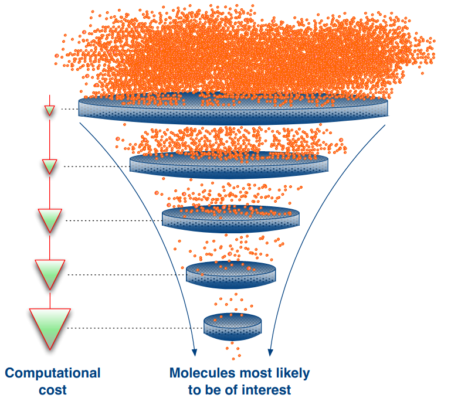
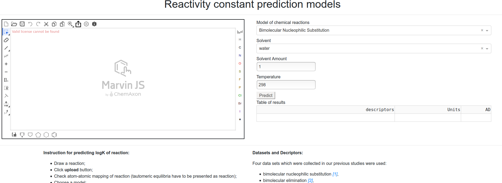
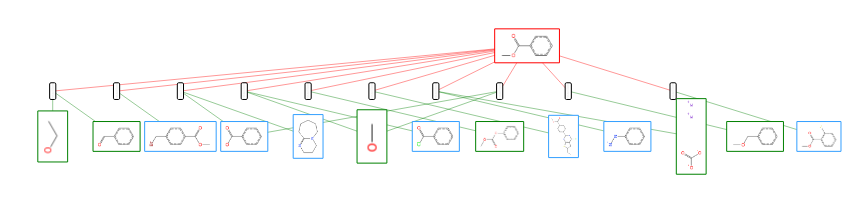

Projects
========

Проект "Повышение эффективности первичного скрининга биологически активных соединений с использованием вычислительных моделей" :ref:`SCREENING2018`

`Models 2018 <//models2018.cimm.site/>`_  `Models 2019 <//models2019.cimm.site/>`_

`USPTO Graph <https://uspto.cimm.site/>`_

`iSynthesis <//cimm.site/projects/isynthesis.html>`_

.. toctree::
    :hidden:

    screening/index

    isynthesis

    planner

