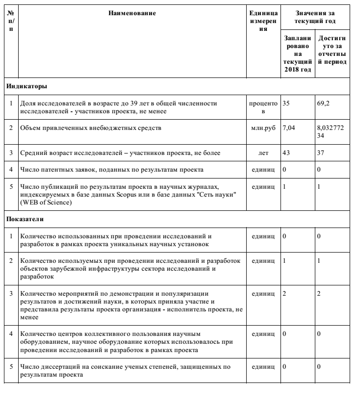
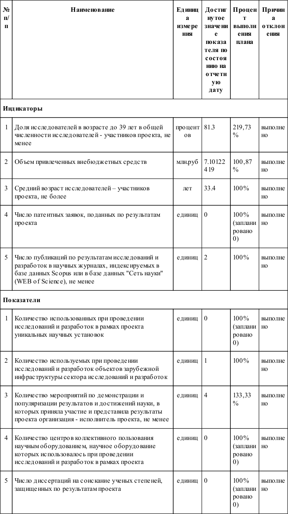
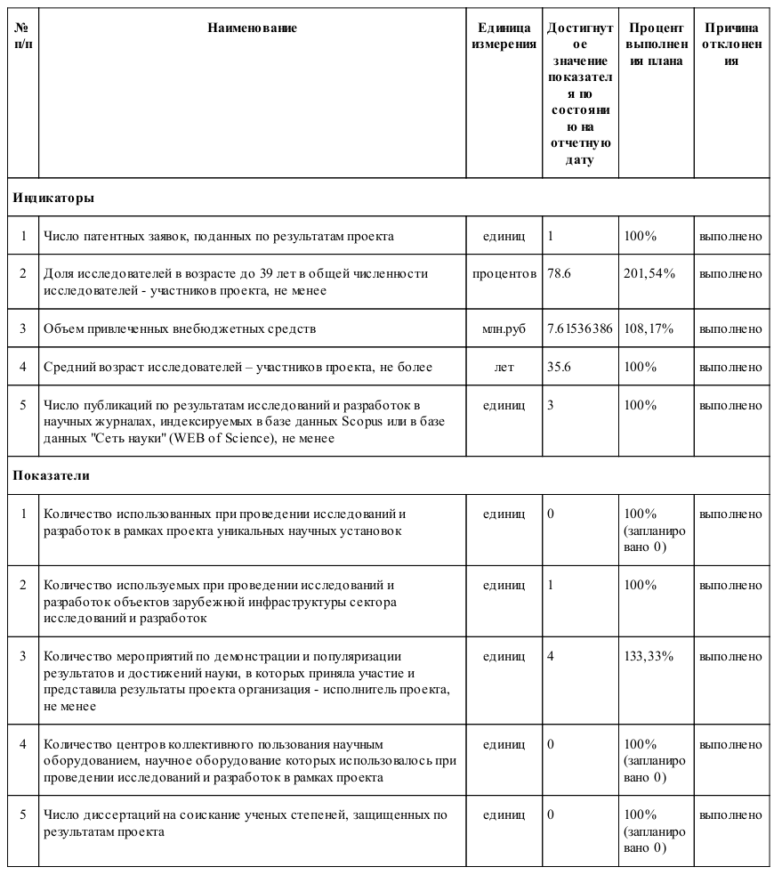

.. _SCREENING2018:

SCREENING2018
=============

Проект "Повышение эффективности первичного скрининга биологически активных соединений с использованием вычислительных моделей"

Сведения о ходе выполнения проекта в рамках реализации федеральной целевой программы `Исследования и разработки по приоритетным направлениям развития научно-технологического комплекса России на 2014-2020 годы <http://www.fcpir.ru/>`_

**СОДЕРЖАНИЕ**

.. toctree::

    steps
    devs
    team
    pubs

ОБЩИЕ СВЕДЕНИЯ ПО ПРОЕКТУ
-------------------------

**Соглашение о предоставлении субсидии с** `Минобрнауки России <https://minobrnauki.gov.ru/>`_ №14.587.21.0049 от 12.02.2018, уникальный идентификатор проекта RFMEFI58718X0049

**Тема проекта:** Повышение эффективности первичного скрининга биологически активных соединений с использованием вычислительных моделей

**Приоритетное направление:** Науки о жизни (НЖ)

**Критическая технология:**   Нано-,  био-,  информационные,  когнитивные  технологии

**Период выполнения:** 12.02.2018 - 31.12.2020 гг.

**Сроки выполнения этапов проекта:**

* :ref:`SCREENING2018_s1`
* :ref:`SCREENING2018_s2`
* :ref:`SCREENING2018_s3`

**Плановое финансирование проекта:** 42.12 млн. руб.

* Бюджетные средства          21.00 млн. руб.,
* Внебюджетные средства     21,12 млн. руб.

**Исполнитель**: `Федеральное государственное автономное образовательное учреждение высшего образования "Казанский (Приволжский) федеральный университет" <https://www.kpfu.ru>`_

**Иностранный партнер:** `Университет Палацкого в Оломоуце(Univerzita Palackho v Olomouci) <https://www.upol.cz/>`_, Чехия

**Ключевые слова**: биологический скрининг, дизайн лекарств, биологическая активность, фармакофоры, моделирование структура-свойство, дизайн библиотек соединений, разнообразные библиотеки, сфокусированные библиотеки, пары сопоставленных молекул, молекулярная стабильность, профиль биологической активности, киназа MARK4,рецептор СВ1, аденозиновый рецептор, конденсированный граф реакции

Сведения о ходе выполнения проекта
----------------------------------

На этапе №1
-----------

В ходе выполнения проекта по Соглашению о предоставлении субсидии №14.587.21.0049 от 12.02.2018 г., с Минобрнауки России в рамках федеральной целевой программы «Исследования и разработки по приоритетным направлениям развития научно-технологического комплекса России на 2014-2020 годы» на этапе №1 в период с 12.02.2018 г. по 31.12.2018 г. выполнялись следующие работы:

получателем субсидии за счет средств субсидии:

1.1 Проведение патентного поиска и поиска по литературе.

1.2 Разработка программного модуля для поиска общего фармакофора на основании структур активных и неактивных молекул.

1.3 Разработка подхода для дизайна библиотек с использованием карт GTM.

1.4 Разработка алгоритма виртуального скринирования библиотек соединений с использованием фармакофорных моделей.

иностранным партнером за счет собственных средств:

1.5 Литературно-патентный поиск, поиск данных в открытой литературе.

1.6 разработка нового подхода для фармакофорного моделирования, основанного на создании сигнатуры фармакофора.

1.7 Разработка модуля для создания разнообразной библиотеки соединений с использованием 3D фармакофорных сигнатур.

При этом были получены следующие результаты:

1. Был разработан подход для создания 3D сигнатур фармакофоров. На основе него разработан и успешно апробирован в нескольких ретроспективных случаях подход для выявления трехмерных сигнатур фармакофоров при создании фармакофорных моделей с использованием информации об активных/неактивных соединениях для последующего виртуального скрининга. Показано, что точность моделей на внешней тестовой выборке в основном достигала значений 50%-100% при достаточно высокой полноте, достигающей 80%.

2. Разработан алгоритм для выявления репрезентативной выборки структурно разнообразных соединений на основе использования карт, полученных с использованием метода Генеративного топографического отображения. Было разработано 7 различных карт, которые были использованы для отбора. Разработанный алгоритм помогает выбирать репрезентативную выборку из представленного набора данных. Предложенный алгоритм позволяет добиться увеличения обогащения выборки активными соединениями на 10%-15% при уменьшении объема выборки до 1%-30% от изначального объема, что достаточно высоко в сравнении с имеющимися аналогами.

3. Разработан подход, который позволяет проводить быстрый скрининг баз данных с использованием разработанного представления молекул в виде фармакофорных сигнатур. Для ускорения процесса скринирования используется трехстадийный алгоритм, включающий скринирование фармакофорных фингерпринтов, изоморфное вложение полных графов фармакофора и генерацию трехмерных фармакофорных хешей. С использованием заранее подготовленной базы данных соединений для скринирования скорость работы составляет до 1 000 000 молекул в час.

4. Проводился сбор данных из базы ChEMBL для последующего моделирования. Был разработан специальный подход для автоматической аннотации активности. Собрано 2 243 052 данных по биологической активности. Начат сбор данных по константам скоростей реакций бимолекулярного нуклеофильного замещения в водной среде и среде вода-ДМСО для последующего моделирования гидролитической стабильности соединений. Полученная база данных химических реакций насчитывает 550 реакций и является уникальной, не имеющей аналогов в мире. Собранные данные требуется для разработки технологий в рамках проекта в последующем.

5. Разработан подход для дизайна разнообразной библиотеки соединений с использованием фармакофорных сигнатур. Основная идея подхода заключалась в отборе библиотек соединений, не имеющих аналогичных фармакофоров. Показано, что обогащение выборки активными соединениями может на 70% превышать долю хитов при случайном отборе.

Предложенная технология поиска фармакофоров использует принципиально новый подход к поиску фармакофоров. В отличие от существующих некоммерческих аналогов не требует знания о «биологически активной» конформации молекулы. В отличие от имеющихся коммерческих аналогов не проводится попарного выравнивания и сравнения молекул в обучающей выборке при создании фармакофора, не используются скоринг-функции. Разработанный подход моделирования является универсальным, с открытым исходным кодом, может быть использован в виртуальном скрининге на основе структуры биомишени. Качество работы подхода превышает качество часто используемого виртуального скрининга с использованием поиска по сходству на фармакофорных фингерпринтах. Таким образом, предложенный подход по ряду параметров превосходит аналогичные работы, определяющие мировой уровень.

Новизна подхода отбора библиотеки разнообразных соединений с использованием карт заключается в принципиально новом подходе к отбору соединений с использованием снижения размерности химического пространства. В отличие от имеющихся подходов, предложенный подход к отбору отличается наглядностью и возможностью использования полученных карт для визуального анализа, построения моделей структура-свойство.

Скорость и качество работы алгоритма скринирования с использованием фармакофорных сигнатур сопоставима или превосходит аналогичные подходы, определяющих мировой уровень. В отличие от коммерческих инструментов не используются функции скоринга или времязатратные процедуры выравнивания фармакофоров. Новизна подхода заключается в использовании принципиально нового типа представления фармакофоров и новых технологий ускорения поиска.

Предложен принципиально новый метод отбора разнообразной библиотеки соединений с использованием фармакофорных сигнатур. Не имеется аналогичных инструментов, которые отбирали бы соединения по имеющимся в них фармакофорам. Качество работы алгоритма сопоставимо с имеющимися аналогами, при этом подход отличается наглядностью, скоростью и простотой интерпретации результатов.

Таким образом, предложены новые вычислительные подходы для отбора библиотек для проведения биологического скрининга.

По качеству полученных результатов предложенные технологии успешно конкурируют с основными мировыми аналогами.

Полученные результаты соответствуют техническим требованиям этапа №1 проекта и подтверждают перспективность продолжения работ по проекту.

Плановые и достигнутые значения показателей результативности реализации проекта на этапе №1 приведены в таблице.

На этапе №2
-----------

В ходе выполнения проекта по Соглашению о предоставлении субсидии №14.587.21.0049 от 12.02.2018 г., с Минобрнауки России в рамках федеральной целевой программы «Исследования и разработки по приоритетным направлениям развития научно-технологического комплекса России на 2014-2020 годы» на этапе №2 в период с 01.01.2019 г. по 31.12.2019 г. выполнялись следующие работы:

получателем субсидии за счет средств субсидии:

2.1 Дизайн разнообразных библиотек соединений с использованием подходов, основанных на представлении молекул в виде 3D фармакофоров и объектов на карте GTM с использованием данных базы PubChem.

2.2 Дизайн разнообразных библиотек соединений с использованием метода исключенной сферы и различных молекулярных отпечатков пальцев (реализованных в библиотеке RDKit) с использованием данных базы PubChem.

2.3 Разработка программного модуля для создания фармакофора на основе структуры биомишени с использованием молекулярно-динамических траекторий.

2.4 Сбор данных по скоростям кислотного гидролиза эфирных связей в водной среде и смеси вода-ДМСО.

2.5 Анализ молекулярно-динамических траекторий с использованием 3D фармакофоров и выявление фармакофоров на основе структуры биомишени.

2.6 Сбор данных по скоростям гидролиза эфирных связей в нейтральной водной среде и смеси вода-ДМСО.

2.7 Сбор данных по изменениям активности соединений в ходе ММР трансформаций для как минимум 20 наиболее хорошо изученных мишеней.

иностранным партнером за счет собственных средств:

2.8 Проведение молекулярно-динамического моделирования комплексов каннабиноидных рецепторов СВ1 и киназы MARK4 с наиболее активными лигандами.

2.9 Разработка подхода для проведения профилирования спектра биологической активности соединений с использованием данных базы ChEMBL.

2.10 Создание фармакофорных моделей, основанных на структуре активных и неактивных по отношению к аденозиновым рецепторам молекул.

2.11 Создание фармакофорных моделей, основанных на структуре активных и неактивных молекул, для спектра из минимум 40 биологических мишеней.

При этом были получены следующие результаты:

1) реализовано и валидировано три подхода создания разнообразных библиотек соединений: с использованием фармакофорных сигнатур, с использованием карт GTM и на основе метода исключенной сферы. Доля активных соединений в отобранной с использованием фармакофорных сигнатур разнообразной библиотеке, может на 70% превосходить метод случайного отбора, при этом для метода отбора разнообразных библиотек с использованием карт GTM оно достигает только 7%. Только первый подход превосходит по качеству референсный метод исключенной сферы, для которого обогащение хитами стабилизируется на уровне около 20%;

2) разработан алгоритм для выявления фармакофоров для скрининга на основе структуры биомишени с использованием фармакофоров, извлеченных из молекулярно-динамических траекторий. Предложено два подхода для ранжирования соединений в скрининге с помощью полученного набора фармакофорных моделей, включая новый подход - покрытия конформеров. Проведение ретроспективной валидации разработанного подхода с использованием данных базы ChEMBL показало, что оба подхода показывают высокое качество скрининга, особенно на этапе раннего обогащения. Использование только сложных фармакофорных моделей позволяет дальше повысить качество скрининга. Доля активных соединений в тестовой выборке, отобранной с помощью предложенных подходов, в 4-42 раза превышает таковую, полученную методом случайного отбора;

3) разработан подход для профилирования спектра биологической активности. Предложенный подход основан на использовании разработанного на втором этапе проекта инструменте виртуального скрининга. Для целей профилирования этот инструмент был доработан, параллелизован и существенно ускорен. Предсказание требует менее 16 мс на предсказание одного свойства на 1 вычислительном ядре. Проведенная валидация показала, что достаточное качество результатов достигается только при использовании достаточно сложных моделей. На основе этой информации был подготовлен комплекс фармакофорных моделей для предсказания 90 видов биоактивности;

4) были собраны данные, необходимые для моделирования различных свойств на следующем этапе выполнения проекта: по константам скорости гидролиза эфирных связей для создания модели гидролитической устойчивости соединений, по изменению биологической активности соединений в ходе ММР трансформации для создания подхода генерации сфокусированных библиотек. Созданы фармакофорные модели для MARK4 киназ, каннабиноидных рецепторов и аденозиновых рецепторов для генерации сфокусированных библиотек соединений, требующихся для проспективной валидации разработанных подходов, а также для разработки новых биологически-активных молекул.

Разработан уникальный комплекс подходов для дизайна лекарств, основанный на использовании фармакофорных сигнатур, который может использоваться для виртуального скрининга на основе структур биомишени, на основе структур активных и неактивных молекул, а также для предсказания профиля биологической активности соединения и дизайна разнообразных библиотек. Имеющиеся коммерческие и некоммерческие аналоги не способны покрывать такой широкий круг задач. Дизайн фармакофоров на основе структур активных и неактивных молекул в отличие от имеющихся аналогов не требует информации о
биологически активной конформации и не проводит попарного выравнивания. Дизайн фармакофоров на основе молекулярно-динамических траекторий в отличие от существующих коммерческих аналогов не требует проведения кластеризации и группировки фармакофоров, ручного вмешательства в процедуру их отбора. Некоммерческих аналогов данного подхода не существует. Комплекс фармакофорных моделей для предсказания множества видов биологической активности соединения не имеет некоммерческих аналогов. В отличие от коммерческих аналогов фармакофоры были получены в полностью автоматизированном протоколе и могут быть достроены на новых данных. В рамках проекта разработан первый в своем роде
метод создания разнообразных библиотек с помощью исключения молекул, имеющих одинаковые фармакофоры.

Скорость и качество работы разработанных алгоритмов с использованием фармакофорных сигнатур сопоставима или превосходит аналогичные подходы, определяющие мировой уровень. Был разработан принципиально новый подход, "покрытия конформеров", для проведения виртуального скрининга с помощью множества фармакофорных моделей извлеченных из молекулярно-динамических траекторий. Показано, что качество виртуального скрининга с его использованием превосходит все имеющиеся аналоги. Параллельно нами был разработан подход для выявления самых важных межмолекулярных взаимодействий в комплексе белок-лиганд. В отличие от некоммерческих аналогов, он позволяет выявить все ключевые взаимодействия для создания фармакофора.

Таким образом, по качеству полученных результатов предложенные технологии успешно конкурируют с основными мировыми аналогами. Технические характеристики всех разработанных подходов полностью удовлетворяют требованиям Технического задания.

Плановые и достигнутые значения показателей результативности реализации проекта на этапе №2 приведены в таблице.

На этапе №3
-----------

В ходе выполнения проекта по Соглашению о предоставлении субсидии №14.587.21.0049 от 12.02.2018 г., с Минобрнауки России в рамках федеральной целевой программы «Исследования и разработки по приоритетным направлениям развития научно-технологического комплекса России на 2014-2020 годы» на этапе №3 в период с 01.01.2020 г. по 31.12.2020 г. выполнялись следующие работы:

получателем субсидии за счет средств субсидии:

3.1 Создание моделей по предсказанию константы скорости разложения соединений в водных растворах и смесях вода-ДМСО.

3.2 Создание веб-приложения для предсказания константы скорости разложения соединений в водных растворах и смесях вода-ДМСО.

3.3 Создание модели для предсказания количественных изменений в активности соединений в ходе ММР транстформаций.

3.4 Разработка инструмента для создания сфокусированной библиотеки соединений с использованием количественных предсказаний изменения активности соединений в ходе ММР трансформации

3.5 Внедрение реализованных в рамках проекта подходов в набор инструментов хемоинформатики RDKit.

3.6 Подготовка заключительного отчета.

иностранным партнером за счет собственных средств:

3.7 Проведение виртуального скрининга библиотеки соединений Университета Палацкого с использованием полученных структуры биомишеней и соединений-лигандов фармакофорных моделей и создание сфокусированных библиотек.

3.8 Проведение высокопроизводительного скрининга созданных сфокусированных библиотек соединений.

3.9 Реализация веб-инструмента для проведения профилирования биологической активности соединений.

3.10 Проведение высокопроизводительного скрининга созданных сфокусированных библиотек соединений.

3.11 Внедрение реализованных в рамках проекта подходов в набор инструментов хемоинформатики RDKit.

3.12 Подготовка заключительного отчета.

При этом были получены следующие результаты:

1. Разработан подход и веб-приложение для предсказания константы скорости и времени полуразложения химических соединений в водных растворах и смесях вода-ДМСО через предсказание констант скоростей реакций различного типа, идущих с участием воды. Точность предсказания константы не превышает 1 логарифмической единицы. Предсказание времени полуразложения было протестировано на независимой выборке времени абиотического разложения молекул. Показано, что предсказанные значения совпадают с истинными по порядку величины.

2. Разработан подход и веб-приложение для создания сфокусированной библиотеки химических соединений проведением в ней замен с использованием пар сопоставленных молекул (ММР) с последующей оценкой изменения биологической активности и выбора соединений с нужными характеристиками. На основании предложенного подхода Иностранный партнер создал собственное решение, в котором замена групп происходит в связывающем кармане биологической мишени с целью максимизации прочности связывания.

3. Разработан ряд новых подходов для предсказания биологической активности. Был предложен подход, которые позволяет оценить вероятность активности соединения на основе фармакофоров, которым она соответствует. Показано, что этот подход позволяет существенно улучшить раннее распознавание при фармакофорном скрининге. Был предложен подход предсказания биологической активности с использованием специальных архитектур нейронных сетей для многовариантного обучения и набора конформаций для каждой молекулы. Этот подход был улучшен за счет использования чувствительных к стереоизомерии дескрипторов на основе фармакофроных сигнатур. Показано, что предложенные подходы достигают более высокой точности предсказания биоактивности по сравнению моделями "структура-свойство", построенными только на низших по энергии конформациях.

4. Проведена проспективная валидация предложенных в проекте инструментов фармакофорного моделирования. Для этого подход дизайна молекул на основе структуры биомишени (без информации об активности молекул) с помощью фармакофорных сигнатур и анализа молекулярно-динамических траекторий использовался для поиска ингибиторов MARK4 киназ. Проведенный экспериментальный скрининг показал, что в отобранных соединениях 8.3% являются активными. Одно соединение имело новый скаффолд и высокую активность (30 нМ) и является перспективным кандидатом для дальнейших исследований. Подход для дизайна молекул на основе структуры лигандов (списка активных и неактивных молекул) с помощью поиска общих фармакофорных сигнатур использовался для поиска ингибиторов аденозиновых рецепторов различных подтипов. Проведенное экспериментальное изучение активности отобранных соединений для различных подтипов, показало, что от 50 до 100% молекул являются активными.

5. Разработано веб-приложение для профилирования спектра биологической активности соединений. Оно основано на предложенном в проекте подходе скрининга с использованием фармакофорных сигнатур и вероятностном предсказании биологической активности с помощью фармакофоров. Подход позволяет предсказывать активность по отношению к 108 биологическим мишеням.

Разработан и тщательно валидирован в ретроспективных и проспективных исследованиях уникальный комплекс подходов для дизайна лекарств, основанный на использовании фармакофорных сигнатур, который может использоваться для виртуального скрининга на основе структур биомишени, на основе структур активных и неактивных молекул, а также для предсказания профиля биологической активности соединения и дизайна разнообразных библиотек. Имеющиеся коммерческие и некоммерческие аналоги не способны покрывать такой широкий круг задач. Дизайн фармакофоров на основе структур активных и неактивных молекул в отличие от имеющихся аналогов не требует информации о биологически активной конформации и не проводит попарного выравнивания. Точность этого подхода проверена в проспективных исследованиях: от 50 до 100% молекул были активными. Дизайн фармакофоров на основе молекулярно-динамических траекторий в отличие от существующих коммерческих аналогов не требует проведения кластеризации и группировки фармакофоров, ручного вмешательства в процедуру их отбора. Некоммерческих аналогов данного подхода не существует. Проведенная проспективная валидация подхода показала, что в отобранных инструментом молекулах 8.3% были истинно активными, причем отобранные соединения отличались высокой новизной и имели новые скаффолды. Комплекс фармакофорных моделей для предсказания множества видов биологической активности соединения не имеет некоммерческих аналогов. В отличие от коммерческих аналогов фармакофоры могут быть найдены в полностью автоматизированном протоколе и достроены на новых данных. В рамках проекта разработан первый в своем роде метод создания разнообразных библиотек с помощью исключения молекул, имеющих одинаковые фармакофоры. Предложенные новые подходы предсказания биологической активности на основе анализа всего семейства конформаций отличаются от имеющихся некоммерческих и коммерческих аналогов возможностью полноценного учета стереохимии молекул любого типа, включая оптическую активность. Эти методы способны сами выбирать требуемую для построения модели конформацию на основе машинного обучения. Подход предсказания стабильности соединений в отличие от имеющихся коммерческих и некоммерческих аналогов позволяет предсказывать стабильность соединений в различных условиях окружающей среды (при различной температуре, рН среды, смесях с различной долей ДМСО). Более того, он позволяет предсказывать потенциальные продукты превращения - данный функционал недоступен в аналогах. Разработанный алгоритм дизайна сфокусированных библиотек с помощью ММР трансформаций не уступает лучшим имеющимся аналогам, реализованным на основе глубокого обучения и генетической оптимизации. При этом предлагаемый подход позволяет контролировать синтетическую сложность соединений.

Скорость и качество работы разработанных алгоритмов с использованием фармакофорных сигнатур сопоставима или превосходит аналогичные подходы, определяющие мировой уровень. Предложен уникальный подход, который позволяет предсказать вероятность активности соединения, что позволяет дополнительно улучшить результаты скрининга без временных затрат. Скорость работы подходов, учитывающих ансамбль конформаций молекул сопоставима или превышает ранее разработанных технологии 4D-QSAR, не уступая им в точности. Скорость работы алгоритма предсказания стабильности соединений не уступает существенно имеющимся аналогам, однако предоставляет дополнительные возможности.

Предложенные в рамках проекта подходы для фармакофорного моделирования, создания библиотек соединений, предсказания стабильности доступны в виде программ с открытыми исходными кодами, либо веб-приложений, что позволяет успешно использовать их сторонними пользователями.

Таким образом, по качеству полученных результатов предложенные технологии успешно конкурируют с основными мировыми аналогами, а по ряду параметров превосходят аналогичные работы, определяющие мировой уровень. Технические характеристики всех разработанных подходов удовлетворяют требованиям Технического задания.

Плановые и достигнутые значения показателей результативности реализации проекта на этапе №3 приведены в таблице.

