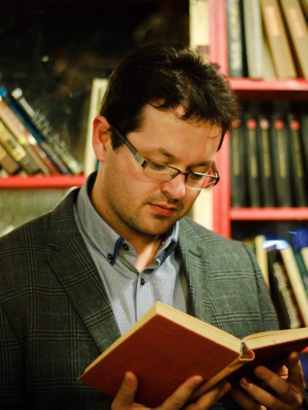
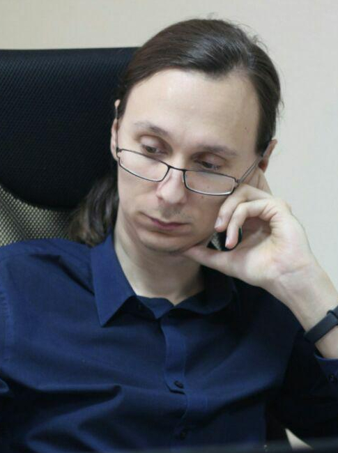

2014 Graduated
==============

**Bodrov Andrei**

**Chubukaeva Dinara**

Higher education (2006-2011): Kazan Federal University, Faculty of Chemistry.

**Gimadiev Timur**

Higher education (2004-2009): Kazan Federal University, Faculty of Chemistry.

:ref:`stsouko`

Higher education (2006-2011): Kazan Federal University, Faculty of Chemistry.

**Petrovsky Anton**
