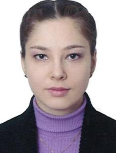

2016 Graduated
==============

:ref:`valya`

Mapping of the chemical universe vs available chemical space of lead-like compounds

**Bakhtiyarov Dmitry**

Development of a method for quickly searching for similar reactions in databases

**Khayarov Khasan**

Development of a web service for storing and processing NMR spectra
