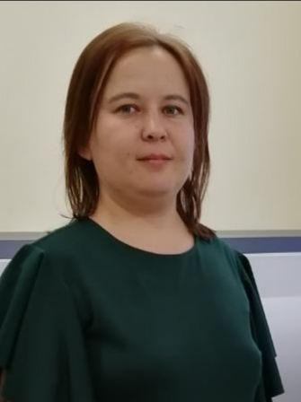
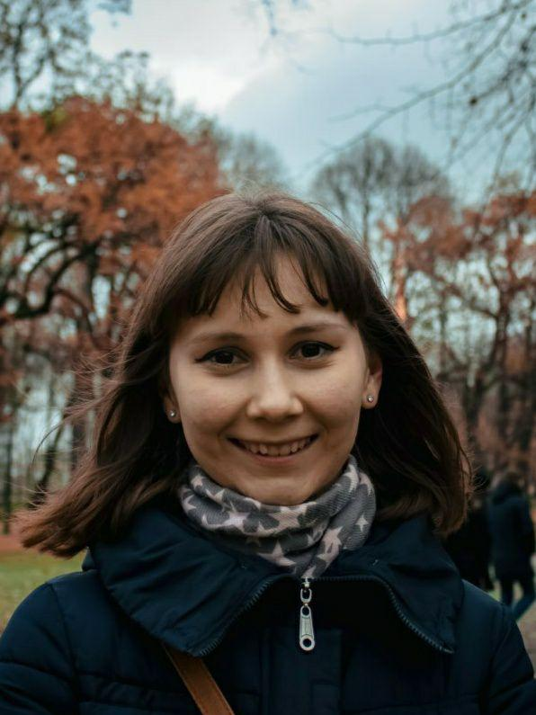

2018 Graduated
==============

**Bekmuratova Feruza**

Crystal structure of bi- and polynuclear Cu (I) complexes with P, N ligands

.. image:: imgs/fatykhova.jpg
    :width: 200

:ref:`adelia`

Development of an integrated database management system for chemical reactions and molecules

**Gimatev Rifat**

Calculations of the ligand binding free energy

**Khayrullina Zulfia**

Atomistic modeling of the structure and properties of composite polymer materials with nonlinear optical chromophores of various structures

**Kutlushina Alina**

The use of a new representation of 3D pharmacophores in virtual screening

**Moiseeva Evgenia**

Crystal structure of fluorine-containing benzothiazinesulfonamides: conformation, intramolecular and intermolecular interaction

**Sattarov Boris**

De novo design of small molecules using the approach combining Artificial Neural Networks and Generative Topographic Mapping. Adenosine A2a inhibitors case
