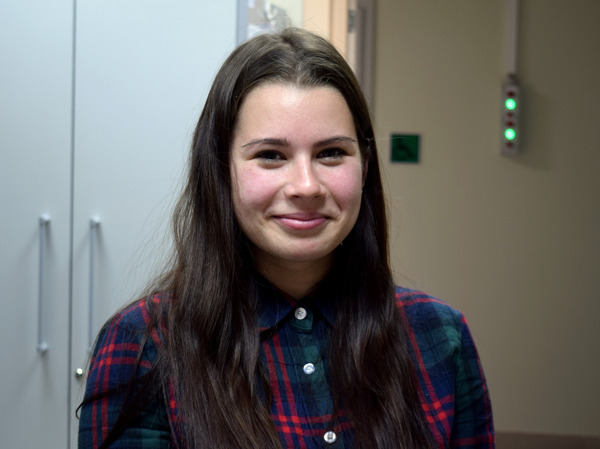

2019 Graduated
==============

.. image:: imgs/batyrshin.jpg
    :width: 200

**Batyrshin Dinar**

Using a network of organic reactions to predict the ways of synthesis of a compound

*Education:*

* Higher education (2013-2017): Kazan National Research Technological University.
* Master in Chemoinformatics (2017-2019): Kazan Federal University, A.M. Butlerov Institute of Chemistry.

**Chernyak Aleksandra**

**Delova Anastasia** (bachelor)

**Khakimova Aigul** (bachelor)

**Kokorin Artem**

**Mindubaeva Guzel** (bachelor)

**Minibaeva Guzel** (bachelor)

**Muhametzyanova Diana**

**Shevelev Maksim** (bachelor)

**Musaeva Sveta**

**Zankov Dmitry**
