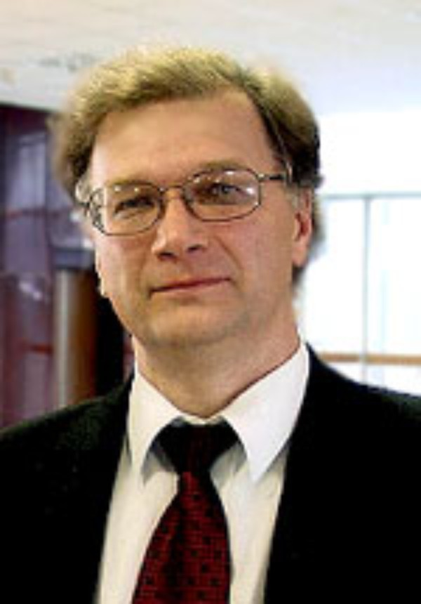
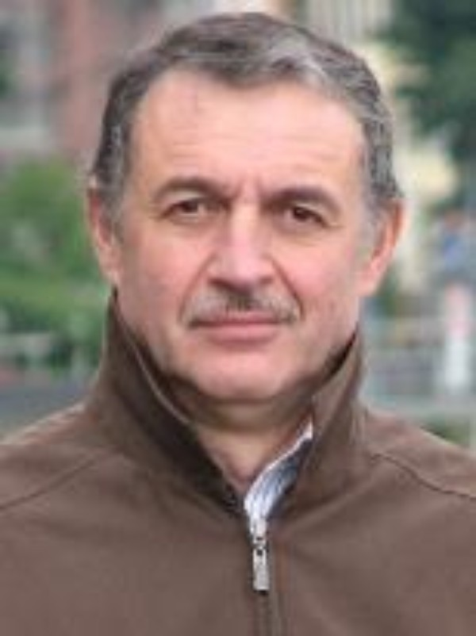
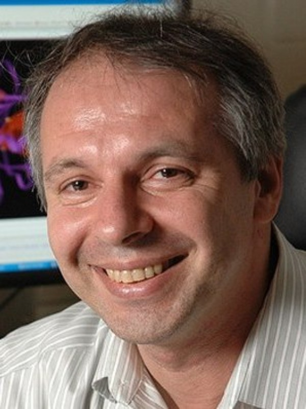
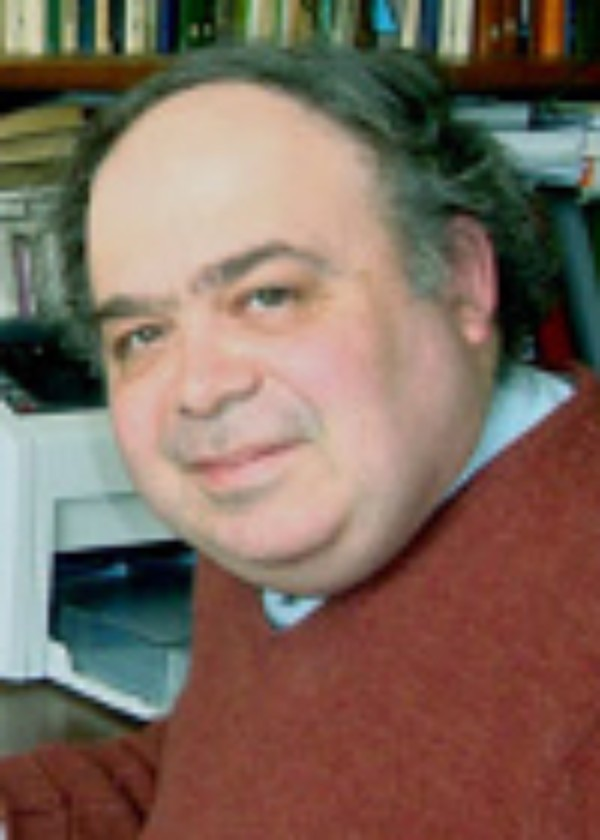
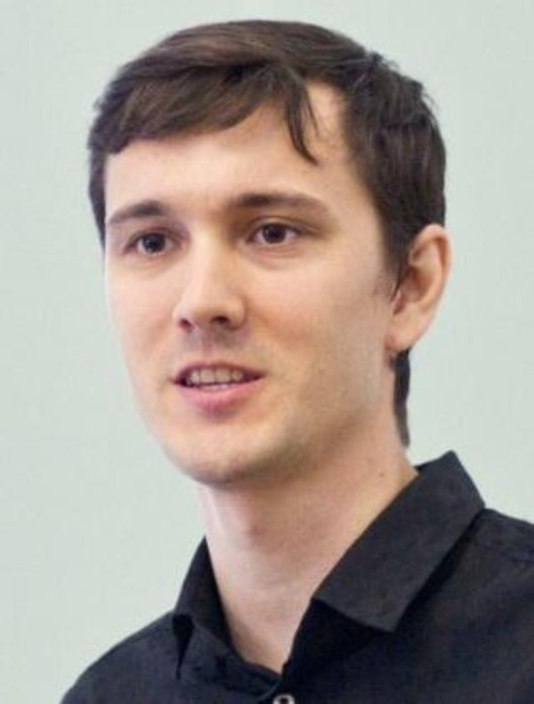
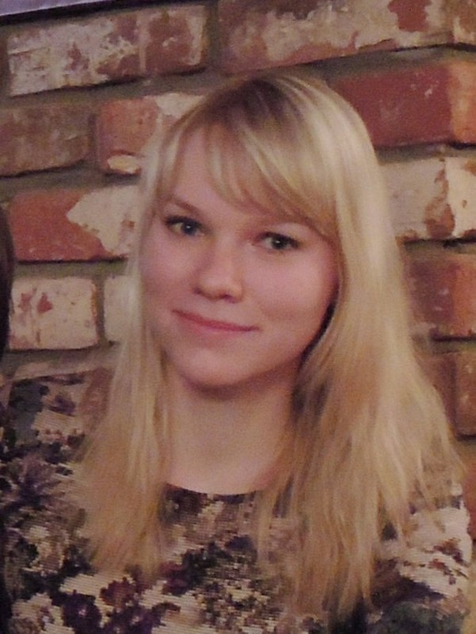
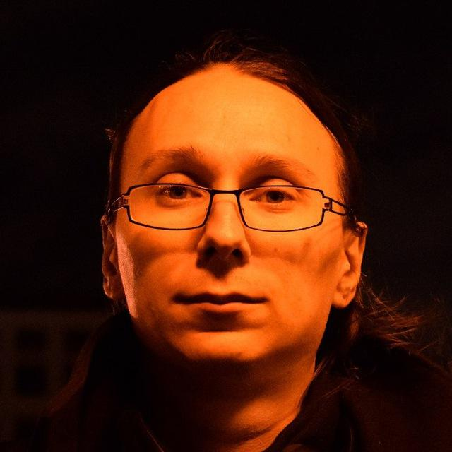
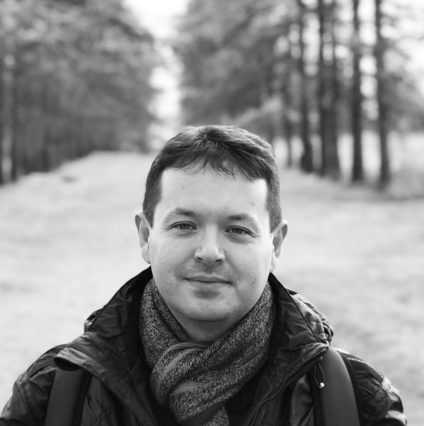

Our Team
========

Head of Chemoinformatics and Molecular Modeling Laboratory is **Antipin Igor Sergeevich**,
senior research fellow, doctor of science, professor,
Corresponding Member of the Academy of Science of the Russian Federation.

*e-mail: Igor.Antipin@kpfu.ru*

Scientific Supervisors
----------------------

**Varnek Alexandre** - doctor of science (HDR). Invited researcher.
Head of Laboratory of Chemoinformatics in University of Strasbourg, professor in University of Strasbourg.

**Tropsha Alexander** - PhD. Invited researcher.
Associate Dean for Pharmacoinformatics and Data Science;
Adjunct Professor in the Biomedical Engineering and Computer Science Departments,
UNC Eshelman School of Pharmacy, UNC-Chapel Hill,  USA.

Laboratory Staff
----------------

**Baskin Igor Iosifovich** - doctor of science.
Invited researcher. Leading Research Associate of Chair of Polymer and Crystal Physics and Laboratory of Physical
Chemistry of Polymers of Faculty of Physics, Moscow State University.

**Madzhidov Timur Ismailovich** - research fellow, candidate of science (PhD).
Associate professor of Department of Organic Chemistry of Alexander Butlerov Institute of Chemistry.

**Tutubalina Elena Viktorovna** - junior researcher, candidate of science (PhD).

**Nugmanov Ramil Irekovich** - senior researcher, candidate of science (PhD).
Associate professor of Department of Organic Chemistry of Alexander Butlerov Institute of Chemistry.

**Gimadiev Timur Rustemovich** - junior researcher, PhD.

.. toctree::
    :hidden:

    nugmanov
