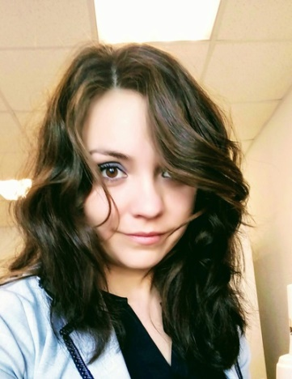

.. _tahmina:

Sibgatullina Tahmina
====================

**Education:**

* Higher education (2005-2010): Kazan Federal University, Faculty of Philology
* Practice (2007, 2008): Jagiellonian University (Poland, Krakow)

**Volunteer:**

* Member of the student scientific society of the Faculty of Philology
* Continuing Education Teacher at Uniqum Kids Early Learning School

**Experience:**

* 2010 – 2019: Secretary, Procurement Manager, Human Resources, Accountant and Estimator. Construction company
* 2019 – present: Laboratory assistant. Chemoinformatics and Molecular Modeling Lab. Kazan Federal University. 18 Kremlyovskaya street, Kazan 420008, Russian Federation
